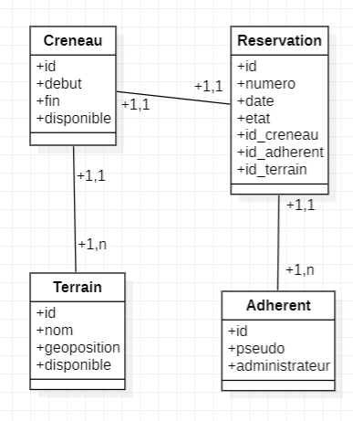

# Api_Badminton
Projet API de Réservation de Terrains de Badminton

# Table des matières

- [Api\_Badminton](#api_badminton)
- [Table des matières](#table-des-matières)
  - [Lancer le Projet](#lancer-le-projet)
    - [Installer les Dépendances](#installer-les-dépendances)
  - [Conception](#conception)
    - [Routes](#routes)
      - [Terrains](#terrains)
      - [Créneaux](#créneaux)
      - [Adhérents](#adhérents)
      - [Réservations](#réservations)
    - [Dictionnaire des Données](#dictionnaire-des-données)
  - [Tableau Récapitulatif des Ressources](#tableau-récapitulatif-des-ressources)
  - [Modèle Conceptuel des Données (MCD)](#modèle-conceptuel-des-données-mcd)
  - [Remarques](#remarques)
  - [Références](#références)
## Lancer le Projet

### Installer les Dépendances

Assurez-vous d'avoir [Node.js](https://nodejs.org/) installé sur votre machine.

## Conception

### Routes

#### Terrains

- **Ressource :** `/terrains`
- **URL :** `/terrains`
- **Méthodes HTTP :** GET, POST
- **Paramètres d'URL/Variations :** N/A
- **Commentaires :** Liste des terrains, ajout d'un terrain

#### Créneaux

- **Ressource :** `/creneaux`
- **URL :** `/creneaux`
- **Méthodes HTTP :** GET, POST, DELETE
- **Paramètres d'URL/Variations :** N/A
- **Commentaires :** Liste des créneaux, ajout et suppression

#### Adhérents

- **Ressource :** `/adherents`
- **URL :** `/adherents`
- **Méthodes HTTP :** GET, POST
- **Paramètres d'URL/Variations :** N/A
- **Commentaires :** Liste des adhérents, ajout d'un adhérent

#### Réservations

- **Ressource :** `/reservations`
- **URL :** `/reservations`
- **Méthodes HTTP :** GET, POST, DELETE
- **Paramètres d'URL/Variations :** N/A
- **Commentaires :** Liste des réservations, ajout et suppression

### Dictionnaire des Données

| ------------------ | --------------- | ---- | ------------- | ------ | ---------------------------------------------- |
| Ressource          | Code            | Type | Obligatoire ? | Taille | Commentaires                                   |
| ------------------ | --------------- | ---- | ------------- | ------ | ---------------------------------------------- |
| Terrains           | id_terrain      | N    | Oui           |        | Identifiant unique du terrain                  |
| Nom                | nom             | A    | Oui           | 1      | A, B, C, D                                     |
| Lieu               | lieu            | A    | Oui           | 100    | Lieu du terrain                                |
| Disponibilité      | disponible      | B    | Oui           |        | true, false                                    |
| ------------------ | --------------- | ---- | ------------- | ------ | ---------------------------------------------- |
| Créneaux           | id_creneau      | N    | Oui           |        | Identifiant unique du créneau                  |
| Date de début      | debut           | D    | Oui           |        | Date de début(ex: 2023-12-25 20:00:00)         |
| Date de fin        | fin             | D    | Oui           |        | Date de fin(ex: 2023-12-25 20:45:00)           |
| Jour               | jour            | A    | Oui           |        | lundi, mardi, mercredi, jeudi, vendredi, samedi|
| ------------------ | --------------- | ---- | ------------- | ------ | ---------------------------------------------- |
| Adhérents          | id_adherent     | N    | Oui           |        | Identifiant unique de l'adhérent               |
| Pseudo             | pseudo          | A    | Oui           | 50     | Pseudo unique par adhérent                     |
| Role               | administrateur  | B    | Oui           |        | true, false                                    |
| ------------------ | --------------- | ---- | ------------- | ------ | ---------------------------------------------- |
| Réservations       | id_reservation  | N    | Oui           |        | Identifiant unique de la réservation           |
| Numéro             | numero          | N    | Oui           |        | Numéro de réservation unique pour l'adhérent   |
| Date et Heure      | date            | D    | Oui           |        | Date et heure de la réservation                |
| Statut Réservation | statut          | A    | Oui           |        | to_confirm, confirmed, canceled                |
| ------------------ | --------------- | ---- | ------------- | ------ | ---------------------------------------------- |

## Tableau Récapitulatif des Ressources

| Ressource         | URL              | Méthodes HTTP       | Paramètres d'URL/Variations                   | Commentaires                        |
|-------------------|------------------|---------------------|-----------------------------------------------|------------------------------------|
| Terrains          | `/terrains`      | GET, POST           | `/{id-terrain}/reservations/{id-reservation}` | Liste des terrains, ajout d'un terrain |
| Créneaux          | `/creneaux`      | GET, POST, DELETE   | `/{jour}/{heure} `                            | Liste des créneaux, ajout et suppression |
| Adhérents         | `/adherents`     | GET, POST           | N/A                                           | Liste des adhérents, ajout d'un adhérent |
| Réservations      | `/reservations`  | GET, POST, DELETE   | N/A                                           | Liste des réservations, ajout et suppression |

Nom de la ressource | URL | Méthodes HTTP | Paramètres d’URL/Variations | Commentaires |
------------------- | --- | ------------- | --------------------------- | ------------ |
Liste des Terrains | `/terrains` | GET | N/A | Liste des terrains disponibles |
Détails d'un Terrain | `/terrains/{id-terrain}` | GET | N/A | Informations détaillées sur un terrain spécifique |
Réserver un Terrain | `/terrains/{id-terrain}/reservations` | POST | N/A | Effectuer une réservation pour un terrain spécifique
Liste des Réservations d'un Terrain | `/terrains/{id-terrain}/reservations` | GET | N/A | Liste des réservations pour un terrain spécifique
Annuler une Réservation | `/terrains/{id-terrain}/reservations/{id-reservation}` | DELETE | N/A | Annuler une réservation pour un terrain spécifique

Liste des Adhérents | `/adherents` | GET | N/A | Liste des adhérents |
Détails d'un Adhérent | `/adherents/{pseudo}` | GET | N/A | Informations détaillées sur un adhérent |
Liste des Réservations d'un Adhérent | `/adherents/{pseudo}/reservations` | GET | N/A | Liste des réservations d'un adhérent

Liste des Créneaux | `/creneaux` | GET | N/A | Liste des Créneaux |
Détails d'un Créneau | `/creneaux/{heure-debut}` | GET | N/A | Informations détaillées sur un créneau |
Liste des Réservations d'un Créneau | `/creneaux/{heure-debut}/reservations` | GET | N/A | Liste des réservations d'un créneau

Liste des Réservations | `/reservations` | GET | N/A | Liste des Réservations |

## Modèle Conceptuel des Données (MCD)

## Remarques

## Références

- Cours UML de Mr. Barry
- Cours REST 